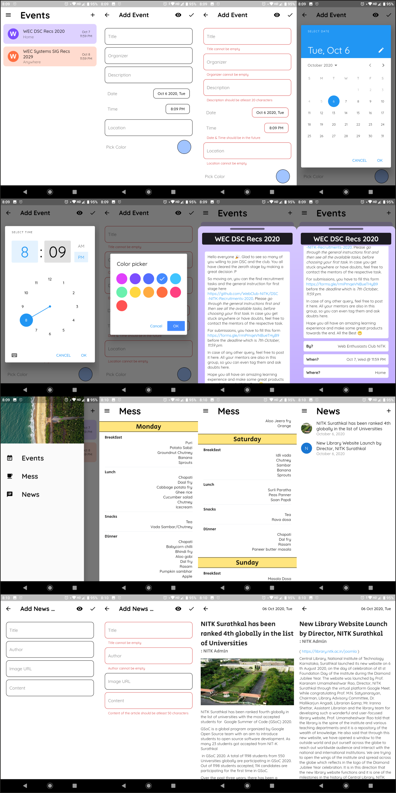
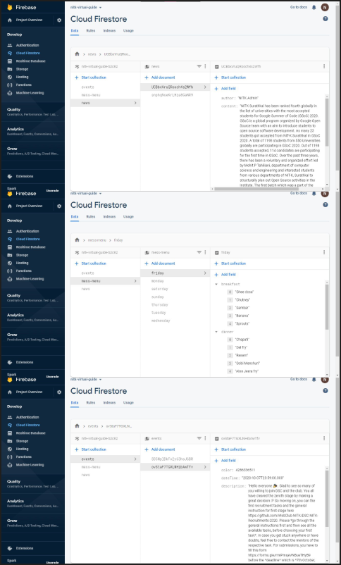

# NITK_Virtual_Guide

Task by Dev Sudents Club (Web Club NITK).

Task: Build a mobile app that will act as a guide for students or any guest visiting NITK.
Some eg: News, events, Mess Menu, Maps.

#

- Task implemented using the **Flutter** framework.
- **Cloud Firestore** from *Firebase* is used as backend.
- Apk is provided in the [releases](https://github.com/navaneethp123/nitk_virtual_guide/releases/tag/1.0.0) section.
- Images and video are given with [Google Drive](https://drive.google.com/drive/folders/1HWP2JmPLJ7N8bhAzsJ2QqQi1-L3cTAWq?usp=sharing) links.

## Features
- ### Events
    - Events from 6 hrs in past to 150 days in future can be viewed.
    - Events can be added from the App.
    - Validation of information done before updating firebase.
    - All people with the App can view the added events.
- ### Mess Menu
    - Menu can be viewed.
    - Any changes made to Menu in Firestore is updated in App.
    - Cannot change menu from the App.
- ### News
    - News articles can be viewed.
    - News articles can be written from the App.
    - Optional image URL can also be given.
    - Validation of information done before updating to firebase.
    - All people with the App can view tha added events.

## Images and Video

Drive Link: https://drive.google.com/drive/folders/1HWP2JmPLJ7N8bhAzsJ2QqQi1-L3cTAWq?usp=sharing

- Video 

    https://drive.google.com/file/d/1eWQeVLK8D6AqbHF0_RratO0qTfaQuIBY/view?usp=sharing

    

- All Screen shots from phone

    Individual Images Drive Link: https://drive.google.com/drive/folders/1UhtIyw8gHrwkEevpCKqIpn357gbdKnMl?usp=sharing

    

- All Screen shots from cloud firstore

    Individual Images Drive Link: https://drive.google.com/drive/folders/1DJmPTjXuQOOmJOl00hoPuucJU-qKdV8l?usp=sharing

    

## Author
**Navaneeth P**
